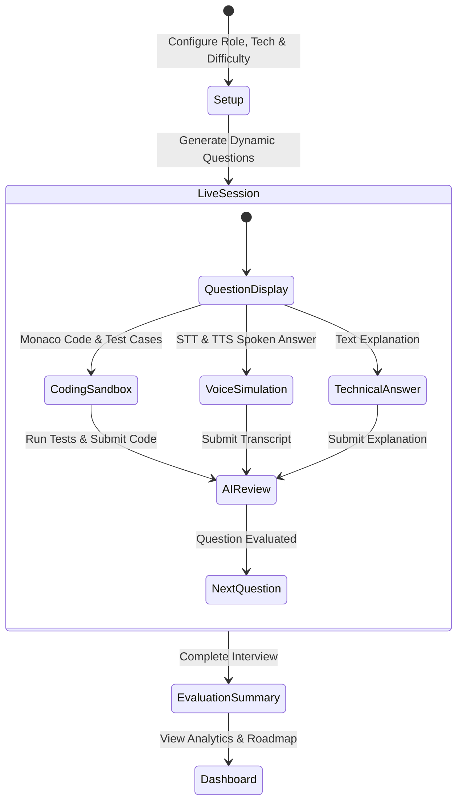

# Antiview — AI-Powered Technical Interview Platform

> **"Your AI-powered technical interview simulator."**

[](https://antriviewai.vercel.app)
[](https://opensource.org/licenses/MIT)
[](https://nodejs.org/)
[](https://react.dev/)
[](https://www.typescriptlang.org/)
[](https://vitejs.dev/)
[](https://tailwindcss.com/)
[](https://microsoft.github.io/monaco-editor/)
[](https://aistudio.google.com/)

**Antiview** is a commercial-grade, full-stack technical interview preparation platform designed to simulate high-stakes software engineering interviews. It combines dynamic AI questioning via **Google Gemini 3.8 Flash**, in-browser code execution using the **Monaco Editor**, real-time voice interaction using the **Web Speech API**, and automated rubric evaluations with personalized preparation roadmaps.

Engineered as a capstone B.Tech final-year project, SDE portfolio piece, and production-ready web application.

---

## 🌐 Live Website

Experience the live application deployed and accessible worldwide:
👉 **[https://gauravguptanoida19-bit.github.io/Antriview-2/](https://gauravguptanoida19-bit.github.io/Antriview-2/)**

*(Also deployed on Vercel: [https://antriview-2.vercel.app](https://antriview-2.vercel.app))*

- **Instant 1-Click Access**: Open the live site and click **"Explore Demo"** or **"1-Click Demo Candidate Login"**.
- **Demo Credentials**:
  - **Email**: `demo@antiview.dev`
  - **Password**: `DemoPassword123!`

---

## Screenshots

| Candidate Dashboard & Analytics | Live Coding Sandbox (Monaco) |
|---|---|
|  |  |

| Voice Interview Simulation | AI Evaluation Scorecard |
|---|---|
|  |  |

---

## Features

### 1. Dynamic AI Interview Engine
- Tailored question generation using **Google Gemini 3.8 Flash** (`gemini-3.8-flash`) across roles (Frontend, Backend, Full Stack, ML, Data) and technologies (React, Node.js, DSA, C++, Python, SQL, System Design).
- Real-time rubric scoring on a 1-10 scale measuring **Correctness**, **Technical Depth**, and **Communication Clarity**.
- Intelligent fallback heuristic engine guaranteeing 100% demo uptime even without external API keys.

### 2. Multi-Mode Interview Simulation
- **Mode 1 — Technical & Conceptual**: Rigorous architectural trade-offs, language internals, and systems reasoning.
- **Mode 2 — Coding Sandbox**: Integrated **Monaco Editor** (VS Code engine) supporting JavaScript, Python, and C++ with automated test-case runner and asymptotic Big-O complexity analysis.
- **Mode 3 — Voice Simulation**: Browser-native Speech-to-Text (STT) and Text-to-Speech (TTS) using the Web Speech API with animated microphone waveforms and transcript editing.
- **Mode 4 — Full Combined Assessment**: Balanced multi-format rounds matching real Silicon Valley hiring loops.

### 3. Interactive Cockpit & AI Avatar
- High-tech animated AI Interviewer avatar with real-time state visualization (`idle`, `speaking`, `listening`, `thinking`, `evaluating`).
- Real-time countdown timer with critical warning alerts, pause/resume, and progress autosave.
- Question navigation pills with status indicators and premature exit confirmation modals.

### 4. Comprehensive Analytics & Progress Tracking
- **Competency Matrix**: 8-factor skill radar chart (DSA, OOP, DBMS, Operating Systems, Computer Networks, System Design, Programming, Web Development) built with Chart.js.
- **Score Progression Trends**: Temporal score progression charts tracking Overall, Technical, and Coding proficiency over time.
- **Actionable Roadmaps**: Automatically synthesized preparation action items and weak spot remediation.

### 5. Historical Assessment Archive
- Dedicated history view with text search, multi-field filtering (status, difficulty, mode), sorting, and pagination.
- Full drill-down views displaying candidate code submissions, test execution timing, and Gemini rubric critiques.

---

## Tech Stack

### Frontend
- **Framework**: React 18 with TypeScript
- **Bundler**: Vite 6.1 (Fast HMR & Optimized Production Chunks)
- **Styling**: Tailwind CSS with dark/light mode and modern Linear/Vercel styling
- **Code Editor**: `@monaco-editor/react` (VS Code Editor engine)
- **Voice APIs**: Browser Web Speech API (`SpeechRecognition` & `SpeechSynthesis`)
- **Data Visualization**: Chart.js & `react-chartjs-2`
- **Icons**: Lucide React
- **Celebration**: Canvas Confetti
- **HTTP Client**: Axios with interceptors and automatic token expiration handling

### Backend
- **Runtime**: Node.js (v20+) with TypeScript
- **Web Framework**: Express.js
- **Database & ODM**: MongoDB with Mongoose
- **Zero-Config Fallback**: Embedded `mongodb-memory-server` with automatic sample seeding
- **AI Integration**: Official `@google/genai` SDK (v2.3+) with `gemini-3.8-flash`
- **Security**: JWT (`jsonwebtoken`), password hashing (`bcryptjs`), `helmet`, `cors`, and `express-rate-limit`
- **Execution Sandbox**: Deterministic test runner with isolated assertion validation

---

## Architecture Diagram

```mermaid
flowchart LR
    subgraph Client["Client (React + Vite + TypeScript)"]
        UI["Tailwind UI"]
        Monaco["Monaco Sandbox"]
        Speech["Web Speech STT/TTS"]
        Charts["Chart.js Analytics"]
    end

    subgraph Server["Server (Express + TypeScript)"]
        API["REST API Router"]
        AuthMid["JWT Auth Middleware"]
        Sandbox["Safe Code Sandbox"]
        AISvc["Gemini Service"]
    end

    subgraph External["Storage & AI Cloud"]
        MongoDB[("MongoDB / In-Memory")]
        GeminiCloud["Google Gemini 3.8 Flash"]
    end

    UI --> API
    Monaco --> API
    Speech --> API
    Charts --> API

    API --> AuthMid
    AuthMid --> Sandbox
    AuthMid --> AISvc
    AuthMid --> MongoDB
    AISvc -->|@google/genai| GeminiCloud
```

---

## Application Workflow



---

## Database Schema

```
User
├── _id: ObjectId (PK)
├── name: String
├── email: String (Unique, Indexed)
├── password: String (Hashed with bcrypt)
├── targetRole: String
├── experienceLevel: Enum ['Junior', 'Mid-Level', 'Senior', 'Lead']
├── skills: Array<String>
└── timestamps: createdAt, updatedAt

Interview
├── _id: ObjectId (PK)
├── userId: ObjectId (FK -> User._id, Indexed)
├── role: String
├── technology: String
├── difficulty: Enum ['Easy', 'Medium', 'Hard']
├── interviewType: Enum ['technical', 'coding', 'voice', 'combined']
├── status: Enum ['pending', 'in_progress', 'completed', 'abandoned']
├── durationMinutes: Number
├── timeSpentSeconds: Number
├── overallScore: Number (0-100)
├── technicalScore: Number (0-100)
├── codingScore: Number (0-100)
├── clarityScore: Number (0-100)
├── overallFeedback: String
├── strengthsSummary: Array<String>
├── weaknessesSummary: Array<String>
├── recommendedRoadmap: Array<String>
└── questions: Array<IInterviewQuestion>
    ├── questionId: String
    ├── title: String
    ├── question: String
    ├── questionType: Enum ['conceptual', 'coding', 'system-design', 'behavioral']
    ├── difficulty: String
    ├── category: String
    ├── starterCode: { javascript, python, cpp }
    ├── testCases: [{ input, expectedOutput, description }]
    ├── candidateAnswer: String
    ├── codeAnswer: String
    ├── codeExecutionResult: { passed, totalTests, passedTests, executionTimeMs, details }
    └── evaluation: { score, correctness, technicalDepth, clarity, feedback, strengths, improvements, timeComplexity, spaceComplexity }
```

---

## Installation & Running Locally

### Prerequisites
- **Node.js**: v20.x or higher
- **npm**: v10.x or higher
- *(MongoDB is optional; Antiview automatically runs an embedded in-memory database with pre-seeded demo records if no local or Atlas MongoDB is detected!)*

### Step 1: Clone Repository
```bash
git clone https://github.com/your-username/antiview.git
cd antiview
```

### Step 2: Install All Dependencies
Install root, backend, and frontend dependencies in one command:
```bash
npm run install:all
```

### Step 3: Configure Environment Variables
Copy the template `.env.example` to `.env` in the root and in `server/`:
```bash
cp .env.example .env
cp server/.env.example server/.env
```

Edit `.env` (Optional):
```env
PORT=5000
NODE_ENV=development
CLIENT_URL=http://localhost:5173
MONGODB_URI=mongodb://localhost:27017/antiview
JWT_SECRET=your_super_secret_jwt_key_2026
GEMINI_API_KEY=your_gemini_api_key_here
```
> **Note**: If `GEMINI_API_KEY` is omitted, Antiview automatically switches to the built-in domain-expert heuristic simulation engine.

### Step 4: Run Development Servers
Start both backend API and Vite frontend concurrently:
```bash
npm run dev
```
- **Frontend**: `http://localhost:5173`
- **Backend API**: `http://localhost:5000`
- **API Health**: `http://localhost:5000/api/health`

### Step 5: Production Build
Compile both TypeScript backend and Vite client:
```bash
npm run build
```

---

## REST API Summary

| Method | Endpoint | Description | Auth |
|---|---|---|---|
| `GET` | `/api/health` | Service health status | Public |
| `POST` | `/api/auth/register` | Register new candidate account | Public |
| `POST` | `/api/auth/login` | Login with email & password | Public |
| `POST` | `/api/auth/demo-login` | 1-Click instant demo candidate login | Public |
| `GET` | `/api/auth/me` | Fetch active user profile | Bearer |
| `PUT` | `/api/auth/profile` | Update profile target role & skills | Bearer |
| `POST` | `/api/interviews` | Create & generate interview session | Bearer |
| `GET` | `/api/interviews` | List sessions with search & filters | Bearer |
| `GET` | `/api/interviews/:id` | Get interview details & questions | Bearer |
| `POST` | `/api/interviews/:id/start` | Mark interview in-progress | Bearer |
| `POST` | `/api/interviews/:id/submit` | Submit verbal/textual answer for AI review | Bearer |
| `POST` | `/api/interviews/:id/code-submit` | Run tests & submit code for Big-O analysis | Bearer |
| `POST` | `/api/interviews/:id/complete` | Finalize session & generate scorecard | Bearer |
| `DELETE`| `/api/interviews/:id` | Delete historical interview session | Bearer |
| `GET` | `/api/dashboard/stats` | Aggregate candidate KPI stats | Bearer |
| `GET` | `/api/dashboard/performance` | Temporal trends & 8-skill radar data | Bearer |
| `GET` | `/api/dashboard/recommendations` | AI weak-point remediation roadmap | Bearer |

For complete schemas and response samples, refer to [docs/api.md](docs/api.md).

---

## Detailed Documentation

Comprehensive architectural and engineering documentation is available in `docs/`:
- **[System Architecture](docs/architecture.md)**: Deep dive into layer responsibilities, sequence diagrams, and design trade-offs.
- **[REST API Specifications](docs/api.md)**: Detailed endpoint schemas, JSON payloads, and response codes.
- **[Database Architecture](docs/database.md)**: Schemas, indexes, relationships, and zero-config memory server explanation.
- **[AI Engine & Gemini Guide](docs/ai-engine.md)**: Prompt designs, rubric definitions, and Big-O derivation mechanics.
- **[Deployment Guide](docs/deployment.md)**: Step-by-step production rollout on Vercel, Render, Railway, and MongoDB Atlas.

---

## Future Improvements

- [ ] Multi-party peer mock interviews with WebRTC live video and collaborative code editing.
- [ ] Direct GitHub / LeetCode profile ingestion to generate questions tailored to candidates' public repositories.
- [ ] Integration with Docker containerized remote execution engines (e.g. Judge0 or Piston) for unrestricted language compilation.
- [ ] Resume PDF parser to automatically tailor question difficulty to candidate work histories.

---

## License

Distributed under the **MIT License**. See `LICENSE` for more information.
