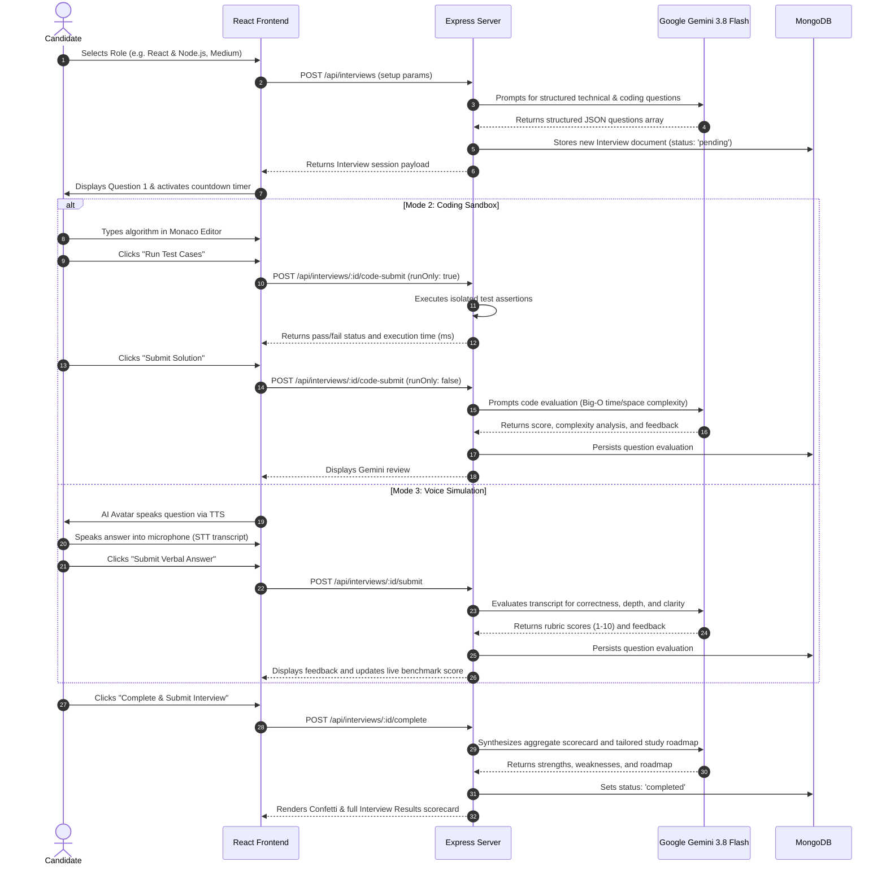

# Antiview Architecture & System Design

Antiview is architected as a modular, decoupled full-stack web application designed for high concurrency, low latency, and realistic technical interview simulations.

---

## 1. High-Level Architecture Diagram

```mermaid
flowchart TD
    subgraph ClientLayer["Frontend Client (React 18 + TypeScript + Vite)"]
        UI["UI Layer (Tailwind CSS + Lucide Icons)"]
        Router["Client Routing (React Router v6)"]
        State["Context State (AuthContext, ThemeContext)"]
        Monaco["Monaco Code Editor Sandbox"]
        Speech["Web Speech API (STT & TTS Engine)"]
        Charts["Analytics & Telemetry (Chart.js)"]
    end

    subgraph APILayer["API & Security Layer (Express + Node.js)"]
        Proxy["Vite Dev Proxy / Nginx Gateway"]
        Security["Security Middleware (Helmet, CORS, Rate Limiter)"]
        AuthMiddleware["JWT Authentication Guard"]
        Validation["Request Body Validation (Zod)"]
    end

    subgraph ServiceLayer["Application Service Layer"]
        AuthService["Authentication & Profile Service"]
        InterviewService["Interview Lifecycle Controller"]
        GeminiService["Google Gemini 3.8 Flash AI Service"]
        CodeRunner["Safe Code Sandbox Runner"]
        SeedService["Zero-Config Database Seeder"]
    end

    subgraph DataLayer["Storage & External AI Services"]
        Mongoose["Mongoose ODM Layer"]
        MongoDB[("MongoDB Database / MongoMemoryServer")]
        GeminiAPI["Google Gemini Cloud (gemini-3.8-flash)"]
    end

    UI --> Router
    Router --> State
    Router --> Monaco
    Router --> Speech
    Router --> Charts
    UI -->|HTTP / REST (Bearer JWT)| Proxy
    Proxy --> Security
    Security --> Validation --> AuthMiddleware

    AuthMiddleware --> AuthService
    AuthMiddleware --> InterviewService
    InterviewService --> CodeRunner
    InterviewService --> GeminiService
    InterviewService --> Mongoose

    GeminiService -->|@google/genai SDK| GeminiAPI
    Mongoose --> MongoDB
    SeedService --> Mongoose
```

---

## 2. Core Architectural Decisions

### 2.1 Single-Page Application (SPA) with React 18 & Vite
- **Rationale**: Real-time coding in Monaco Editor and live speech transcription require seamless, uninterrupted state. Server-side page reloads would interrupt Web Speech recognition and destroy the Monaco editor undo/redo stacks.
- **Benefits**: Sub-second client navigation, fast HMR in development via Vite, and clean component isolation.

### 2.2 Monaco Editor Integration
- **Rationale**: Provides an authentic engineering interview experience identical to VS Code (syntax highlighting, indentation, multi-cursor, bracket matching).
- **Security**: Code entered into Monaco is sent to an isolated mock validation runner. Arbitrary candidate code is **never** executed directly on the host operating system with `eval` or unsafe child processes.

### 2.3 Web Speech API for Zero-Latency Voice Simulation
- **Rationale**: Eliminates costly server-side audio streaming pipelines and expensive external voice API subscriptions while providing instant local text-to-speech (TTS) and speech-to-text (STT) inside supported modern browsers.
- **Graceful Degradation**: If browser microphone permissions are blocked or unsupported, the UI cleanly reveals interactive keyboard fallback fields without breaking the interview flow.

### 2.4 Google Gemini 3.8 Flash AI Integration
- **Rationale**: `gemini-3.8-flash` delivers 1M token context windows, balanced latency, and structured JSON output schema enforcement.
- **Resilience Strategy**: If the API key is not supplied or rate limits are reached during demonstrations, an internal domain-specific heuristic generator transparently serves curated interview challenges and rubric evaluations so demos never crash.

### 2.5 Zero-Config Dual-Mode Database
- **Rationale**: Eliminates local MongoDB installation prerequisites for evaluators, professors, and recruiters reviewing the code repository.
- **Mechanism**: The backend attempts to connect to `MONGODB_URI`. If absent or unreachable, it dynamically initializes an embedded `MongoMemoryServer` and auto-populates realistic demo interviews, analytics, and accounts.

---

## 3. Data Flow: An Interview Turn


